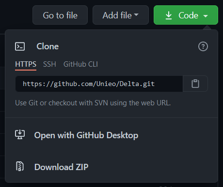
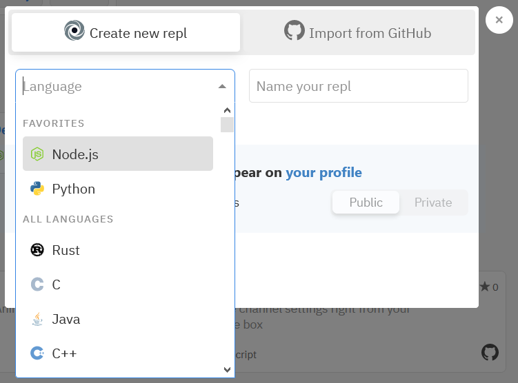
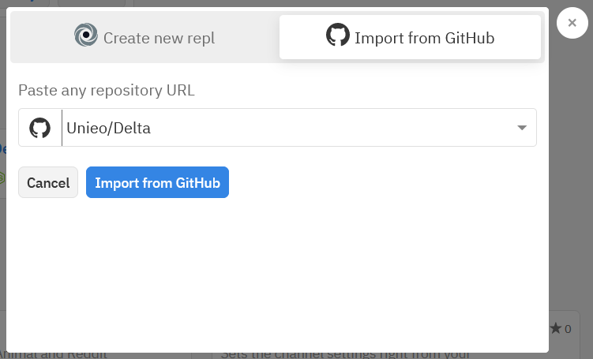

# Info

Delta is a simple to use bot. It specialises in Animal and Reddit Commands, making the bot suitable for a young audience.

Go to [Delta's Documentation](https://unieo.gitbook.io/delta-docs/) to learn more about it.

# Running

There are two very simple ways to run the bot. You can either run it on your local device or Repl.it.

## Local Device

#### Needed Stuff

-   [Code Editor](https://www.geeksforgeeks.org/top-5-code-editors-in-2020/)(I would recommend [VSCode](https://code.visualstudio.com))
-   [Node.js](https://nodejs.org/)
-   [Discord Account](https://discord.com/register)

### Setup

1.  Go to Delta's Repo on Github
2.  Click the **Code** option and then **Download ZIP**
3.  Once Downloaded, extract the file
4.  Open the folder in the code editor of your choice

### Important

Ok, now we have successfully setup Delta's repo on your local computer/device and now you only have to rename the `token.example.json` file to `token.json` and inside it (between the empty `""`) place your bot's token from [Discord Dev Portal](https://discord.com/developers/applications). After that rename `config.example.json` to `config.json` and inside it, fill in all the details.

### Running

Running the bot is very simple, just open the command prompt to the directory in which the folder is located and run `node .` and the bot should be running.

## Repl.it

#### Needed Stuff

-   [Repl.it Account](https://repl.it/signup)
-   [Discord Account](https://discord.com/register)
-   [Github Account](https://github.com/join)

### Setup

1.  First go to Delta's Repo on Github
2.  Fork it (Top right corner)
3.  Now go to [Repl.it](https://repl.it/)
4.  Click on the **+** button in the top right corner
5.  Click on the **Import from Github** tab
    
6.  Select the Forked Repo (Name will most probably be Delta) and then Import from Github
    

### Important

Ok, now we have successfully setup the repo on repl.it and now you only have to rename the `token.example.json` file to `token.json` and inside it (between the empty `""`) place your bot's token from [Discord Dev Portal](https://discord.com/developers/applications). After that rename `config.example.json` to `config.json` and inside it, fill in all the details.

### Running

Now you simply start the bot using the green **Run** Button and the console will print `Server is online` and `Bot is online`, this means that the bot should be online!

## Note

-   Keep on updating the dependencies using npm.
-   You need to create an application for your bot on you own.
-   If you experience any problems then create an [issue](https://github.com/Unieo/Delta/issues) on Github.
